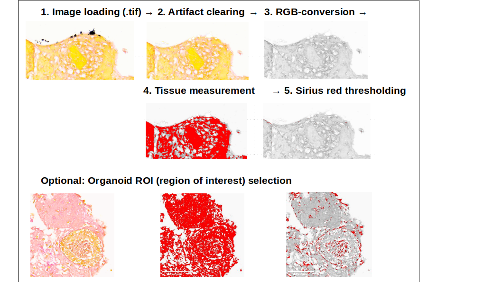
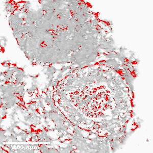
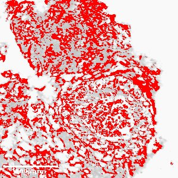
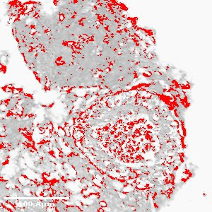

Sirius red quantification for organoid slices
===========

Author: Anja Hess

Date: 2023-JUN-05

## 1. Description
Command line interface and scripts to quantify sirius red stainings in organoid (or theoretically any) 
immunohistochemistry stainings. Modes for the analysis of entire slides or single organoid regions are provided. 
Refer to end of this file for citation information.

The Sirius red quantification module was adopted from the NIH-Image J macro “Quantifying Stained Liver Tissue“ (available at https://imagej.nih.gov/ij/docs/examples/stained-sections/index.html, requested 2020-11-14). 

## 2. Before you start
Make sure you are in a **Linux/Unix** environment and installed **ImageJ** and **python => 3.6**.
Then, from within the sirius_red package, copy all macros to your ImageJ folder:

    cp ij_macros/* /path/to/your/ImageJ/macros/

Next, append required functions to your startup macro (only once!).

    cat startup_macro/StartupMacros.txt >> /path/to/your/ImageJ/macros/StartupMacros.txt
    

## 3. Important: required folder architecture
The folder structure below is required prior to usage! An **example folder** with two test images is provided with this package.
We recommend testing the script once with this folder before you proceed with your own images.
Input format of all images is **.tif**.

### 3.1 Check out the example folder
Each folder must contain **at minimum** the folders **input/whole_slide** and within **whole_slide**, all **tif** images belonging to your sample.
The folder ./example in this package contains an organoid sample (named 15-1) 
with raw images.

    ├── F15-1
       ├── input
          ├── whole_slide
             ├── 15-1_orbital_shaker_CTRL_1.tif
             └── 15-1_orbital_shaker_CTRL_2.tif

### 3.2 Perform a test run 

    cd ./bin
    bash sirius_red.sh /path/to/your/ImageJ/ all_folder_sirius_red_quanti_whole-slide ../example/

This will give you the following response:

    -----------------------------------------------------------------------------
                 S I R I U S   R E D   Q U A N T I F I C A T I O N
                            I N      O R G A N O I D S          
    
    -- ImageJ: /home/.../ImageJ/
    -- Script: ../ij_scripts/all_folder_sirius_red_quanti_whole-slide.ijm
    -- Light factor: 1.3
    -- Your images: ../example/
    -----------------------------------------------------------------------------
    
    -- Found sample: F15-1
    -- Analyzing /home/.../sirius_red/example/F15-1
    
    -----------------------------------------------------------------------------
    Finished analysis
    Results are in F15-1/results/
    -----------------------------------------------------------------------------

Now you can optionally proceed selecting single organoids (ROIs) interactively ...
Note: We assume your **tif** is properly **scaled to um (microns/micrometer)**.
The default size will be 300x300 µm and you can change that in the **select_organoid_rectangle...** macro in ./ij_macros,
but remember this changed file needs to go to you ImageJ macro directory before taking effect.

    bash sirius_red.sh /path/to/your/ImageJ/ all_folder_organoid-selection ../example/

... and analyze those as well.

    bash sirius_red.sh /path/to/your/ImageJ/ all_folder_sirius_red_quanti_organoid-ROIs ../example/

... which will output you thresholded images and a **results.csv** file for downstream anaylsis.

# Usage 
Once you successfully ran the example above you can proceed with your own images.

    cd ./bin

    # Whole slide mode
    bash sirius_red.sh /path/to/your/ImageJ/ all_folder_sirius_red_quanti_whole-slide ../path/to/your/images/

    # To generate organoid ROIs (Regions Of Interest) from those:
    bash sirius_red.sh /path/to/your/ImageJ/ all_folder_organoid-selection /path/to/your/images/
    bash sirius_red.sh /path/to/your/ImageJ/ all_folder_sirius_red_quanti_organoid-ROIs /path/to/your/images/

# Light factor
Scanned slides can vary in brightness depending on staining, microscope, scanner, and so forth. To account for that, we have introduced a **light factor**, which can be adjusted for individual experiments (staining rounds).

**Note:** Controls and experimental samples **have to** have the **same** light factor to be compared to each other.

**Default:** 1.3

**Pale stainings:** we recommend lowering the factor to ~0.9, but this may be different for your images.

**Implementation:** Add the light factor as a fourth argument (float with . separation):

    bash sirius_red.sh /path/to/your/ImageJ/ all_folder_sirius_red_quanti_whole-slide ../example/ 0.9

Example, light factor 1.1:

Example, light factor 1.2:

Example, light factor 1.3:

## Citation

**Hess, A. et al. Single cell transcriptomic landscapes of human liver organoids stratify models of non-alcoholic fatty liver disease. 2022.07.19.500693 Preprint at https://doi.org/10.1101/2022.07.19.500693 (2023).**